

    

    
    
    
    
    
    

    <a href="https://www.tduckcloud.com">官方网站</a>
    ·
    <a href="https://doc.tduckcloud.com">部署文档</a>
    ·
    <a href="https://gitee.com/TDuckApp/tduck-platform/issues">用户社区</a>
    ·
    <a href="https://space.bilibili.com/409825300">Bilibili频道</a>

    ⭐ 如果 TDuck 对您的项目有所帮助，欢迎 Star 支持项目持续发展

---

简体中文 |  [English](./README_en.md)

## 为什么选择 TDuck

TDuck 是一款企业级表单与数据采集平台，支持拖拽式表单设计、私有化部署和开放集成，帮助企业快速构建业务数据入口，实现数据的高效采集与流转。相比传统 SaaS 表单产品，TDuck 提供更高的数据控制权、更灵活的部署方式以及更强的系统集成能力。

### 功能特性

- 支持 **27+自定义组件** ，拖拽式快速生成表单问卷。
- 支持单行文本、多行文本、日期、下拉、单选、文件上传、排序、级联、轮播、一键定位、手机号验证、矩阵量表、子表单等组件。
- 支持通过文本批量导入表单组件，支持题目显隐逻辑设置。
- 表单数据，支持数据新增、编辑、导出、打印、预览和打包下载附件。
- 表单外观支持头图、背景图、背景颜色、按钮文字等配置。
- 报表支持对问题实时统计分析并以图形（柱状图、折线图、饼图）的形式展示输出和导出png图片。
- 提交后自定义文案、提交后自动跳转网址。
-  **每个微信、账号、ip、设备、答题次数限制、支持设置允许填写时间、记录微信个人信息** 。
- 支持发邮件、微信公众号模板推送提醒。
- 支持 **数据同步Api（全量数据）、数据WebHook推送（可订阅事件：新增、修改、删除）** 。
- 支持保存至模板中心，支持从模板中心选用模板创建表单问卷。
- 用户管理，新增用户、修改用户、删除用户。
- 文件存储自定义配置： **支持阿里云、七牛云、又拍云、本地、通用S3协议上传** 。
- 支持 **邮件、短信（阿里云、腾讯云、中昱维信）、微信公众号参数配置** 。
- 支持回收中心，快速恢复问卷。
- 支持配置[TReport可视化大屏](https://gitee.com/TDuckApp/tduck-report-platform)，高效展示数据

### 预览-社区版 - Preview

如需在线体验系统👉：[官网体验地址](https://www.tduckcloud.com) 

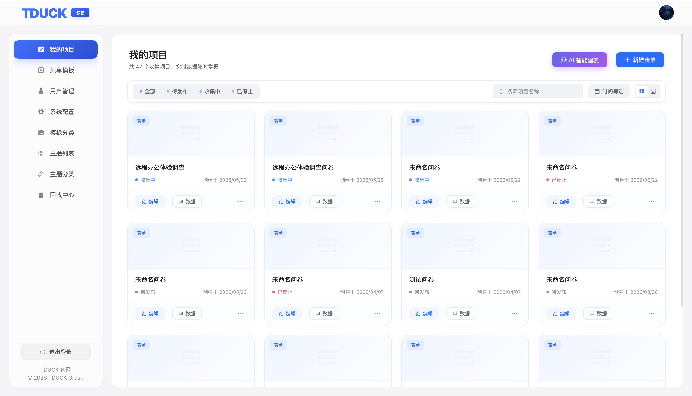

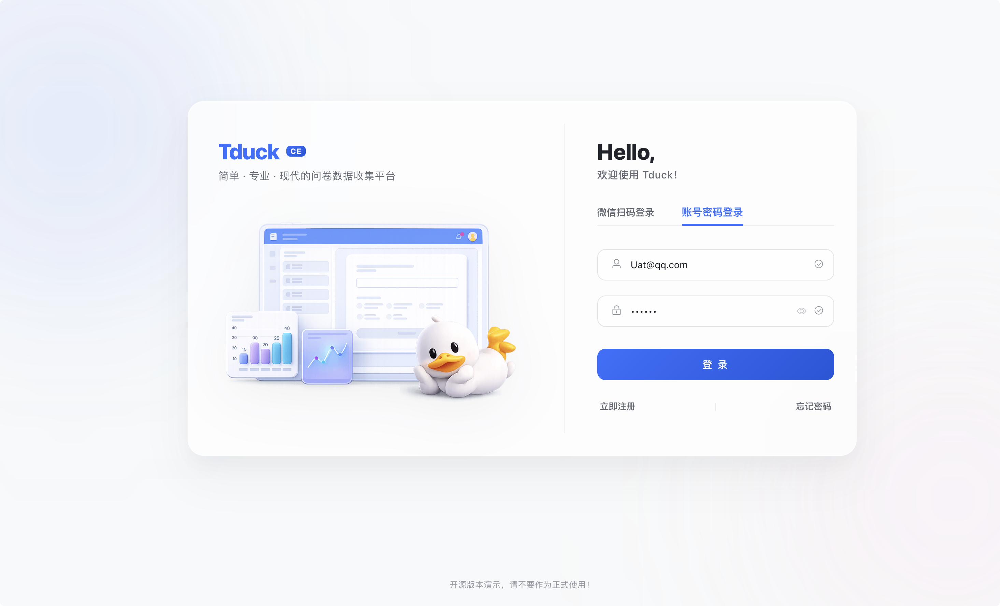

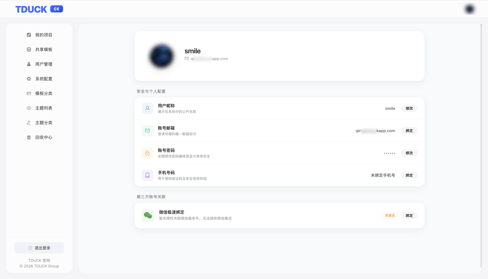
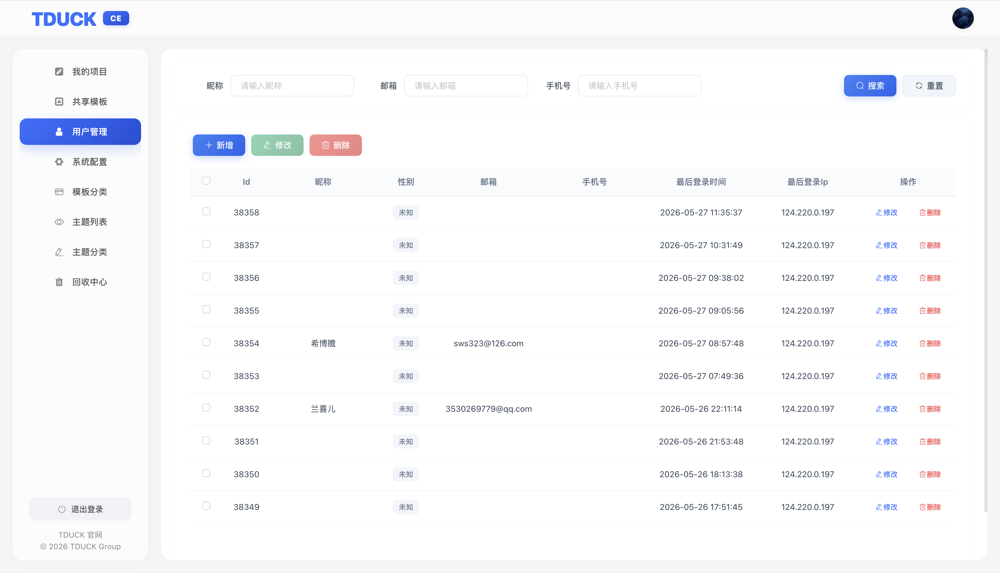
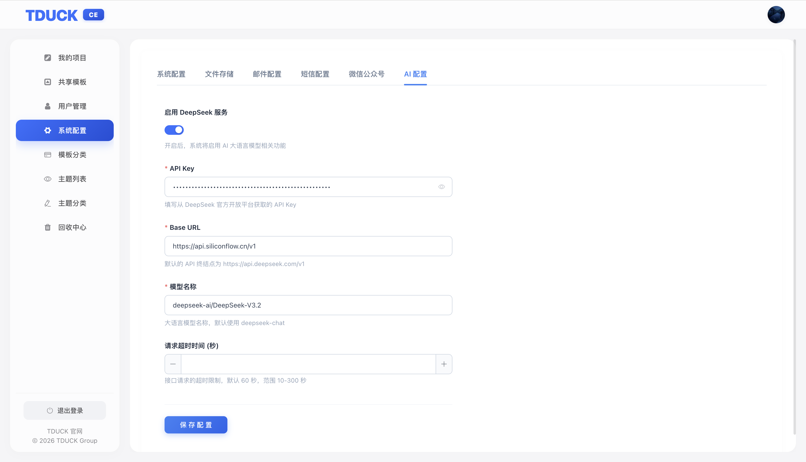
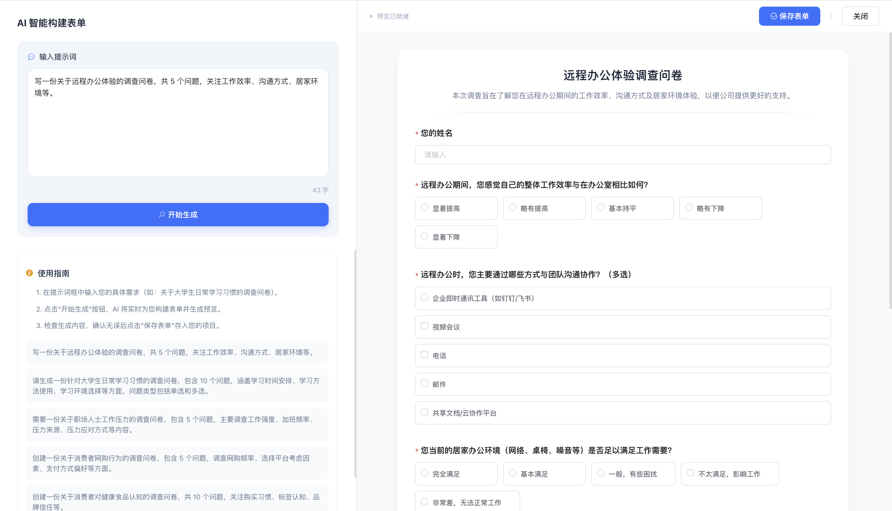
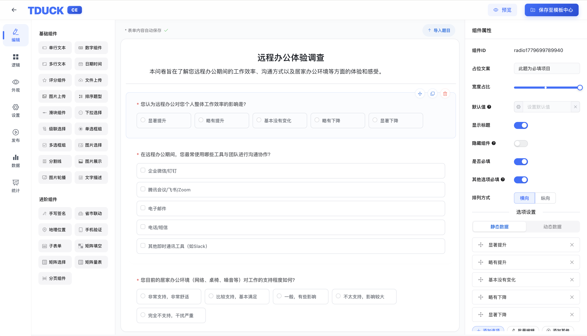
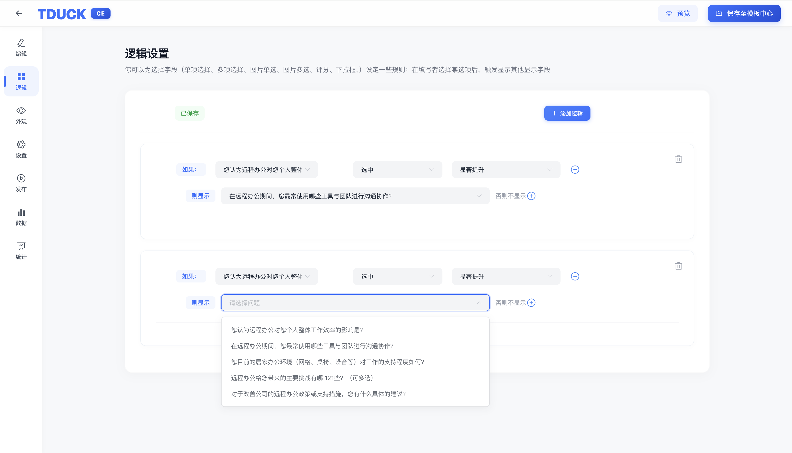
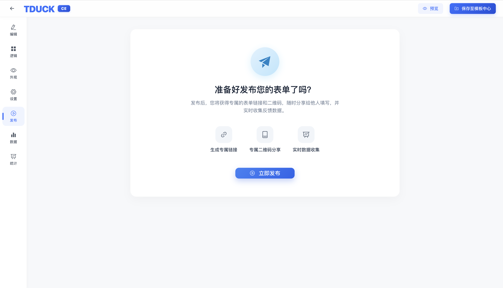
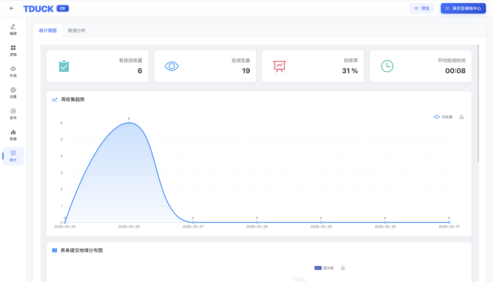
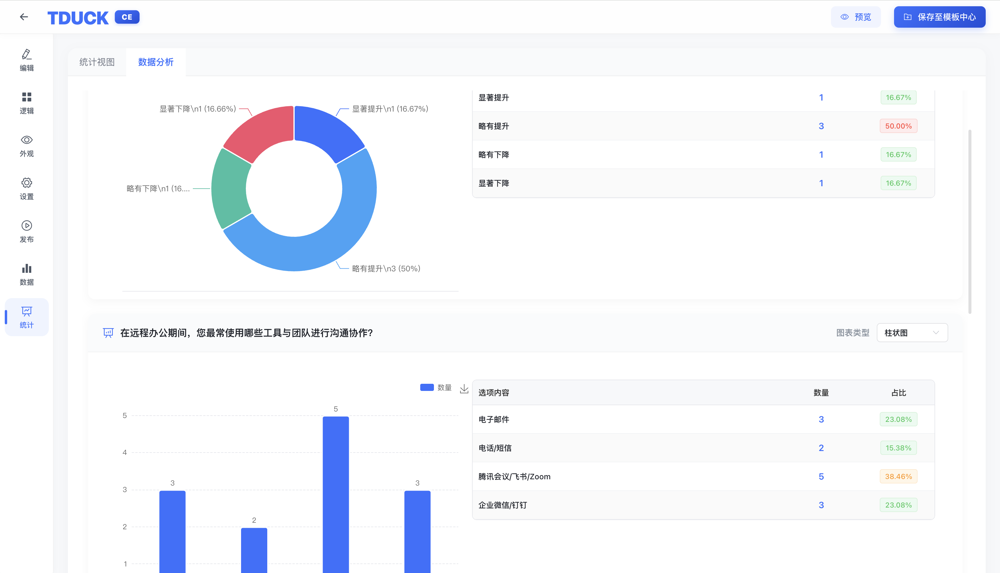
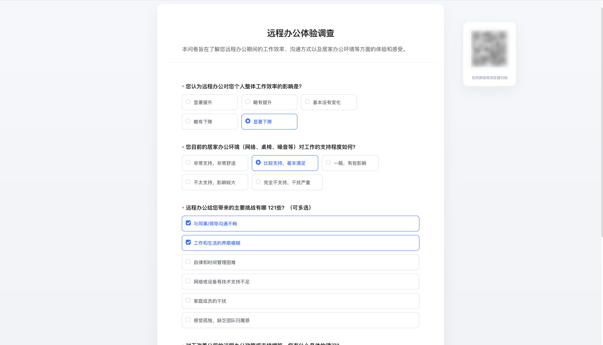

### 版本说明

表单系统有3个版本（社区、Pro、TDuckX） [填鸭表单产品能力对比](https://www.tduckcloud.com/doc/x/nSJMvQh6)

所有版本的填鸭表单数据都可以通过WebHook集成至大屏端，实现数据同步：[表单与TReport数据同步教程](https://www.bilibili.com/video/BV1MH4y1K7Xa/)；

| 核心维度     | 传统 SaaS 表单 | TDuck 社区版        | **TDuckX/Pro 企业源码版** |
| -------- | ---------- | ---------------- | ---------------- |
| 数据归属     | 存储于第三方平台   | 企业自有服务器          | 企业自有服务器          |
| 私有化部署    | 💰      | ✔️ 免费            | ✔️ 支持            |
| 是否开源     | ❌          | ✔️ 后端开源          | ✔️ 完整源码授权        |
| 源码交付     | ❌          | ✔️ 支持                | ✔️ 完整交付          |
| 商业授权     | 按账号订阅      | MIT 开源           | ✔️ 商业授权协议        |
| 二次开发能力   | 受限         | 可扩展              | ✔️ 深度二开          |
| 项目交付能力   | 不适合定制项目    | 基础能力             | ✔️ 可作为交付系统       |
| API 集成能力 | 部分开放       | 支持 API / WebHook | ✔️ 深度系统集成        |
| 权限与组织体系  | 简化版        | 基础支持             | ✔️ 企业级 RBAC      |
| 长期成本结构   | 持续订阅       | 自主控制             | 一次授权长期使用         |
| 版本升级保障   | 平台控制       | 社区节奏             | ✔️ 企业持续升级支持      |
| 法务合规风险   | 数据外部存储     | 自主可控             | ✔️ 可进入采购流程       |

> 如果您正在评估将表单系统用于商业项目或私有化交付，建议重点关注源码授权与长期成本结构。

### 部署安装
> - 部署管理员账号：admin@tduckcloud.com
> - 部署默认密码：123456

- 方式一：使用宝塔面板一键安装 🔥推荐 https://doc.tduckcloud.com/openSource/deploy/deployforbt.html

- 方式二：使用Docker快速启动 https://doc.tduckcloud.com/openSource/deploy/dockerDeploy.html

- 方式三：使用宝塔部署项目 https://doc.tduckcloud.com/openSource/deploy/openSourceDeploy.html

- 方式四：前后端分离部署 https://doc.tduckcloud.com/openSource/deploy/fenli.html

### 相关文档
- [填鸭表单系列产品能力对比](https://www.tduckcloud.com/doc/x/nSJMvQh6)
- <a href="https://doc.tduckcloud.com/openSource/deploy/deployforbt.html" target="_blank">宝塔一键安装（小白篇）</a>
- [前端项目地址](https://gitee.com/TDuckApp/tduck-front)
- [小程序插件](https://doc.tduckcloud.com/functionDesc/uniappDesc.html)
- 如果您在使用社区版过程中遇到了问题，可在社区查看常见问题或留言进行求助 - [点击进入填鸭问答社区](https://gitee.com/TDuckApp/tduck-platform/issues)

### License

MIT License

